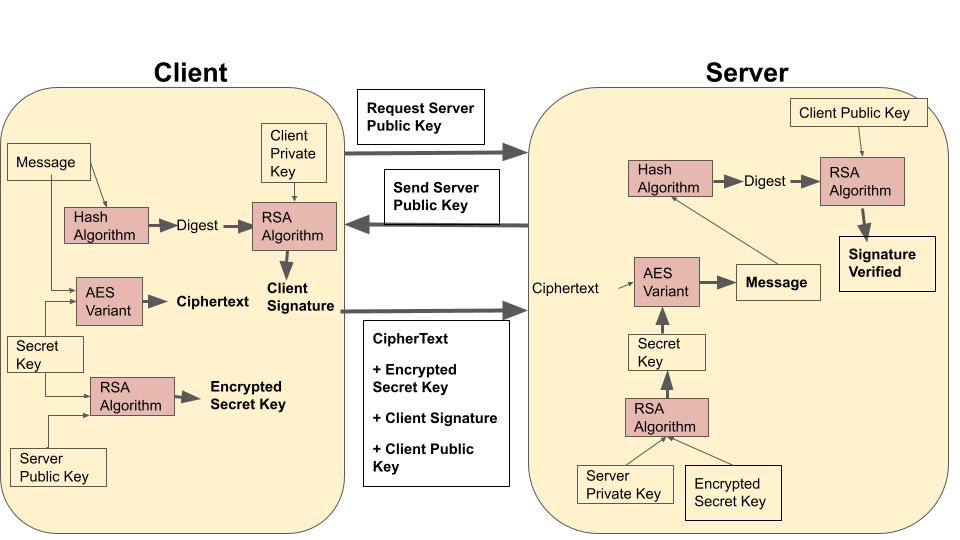
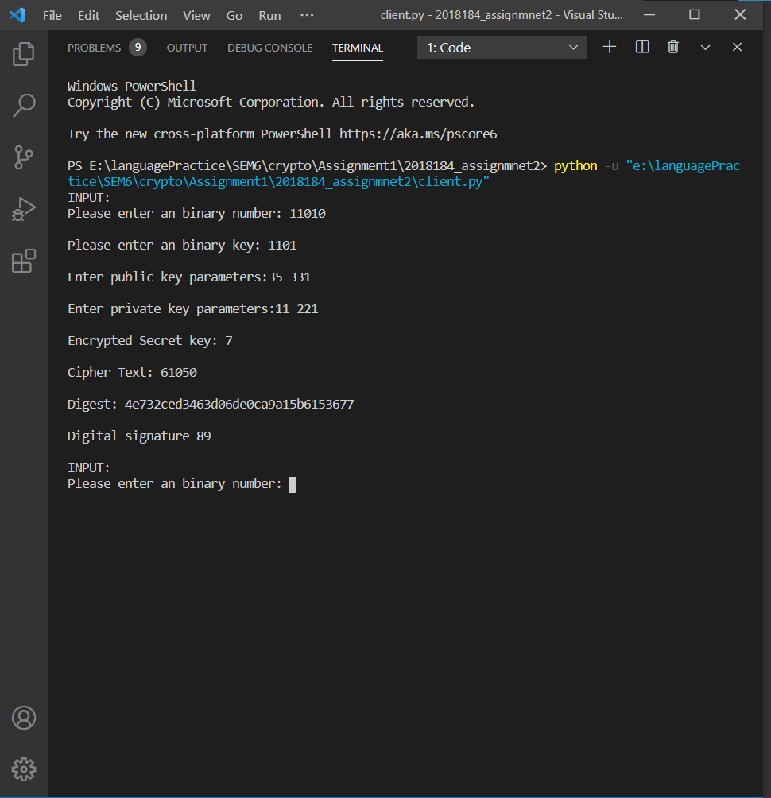
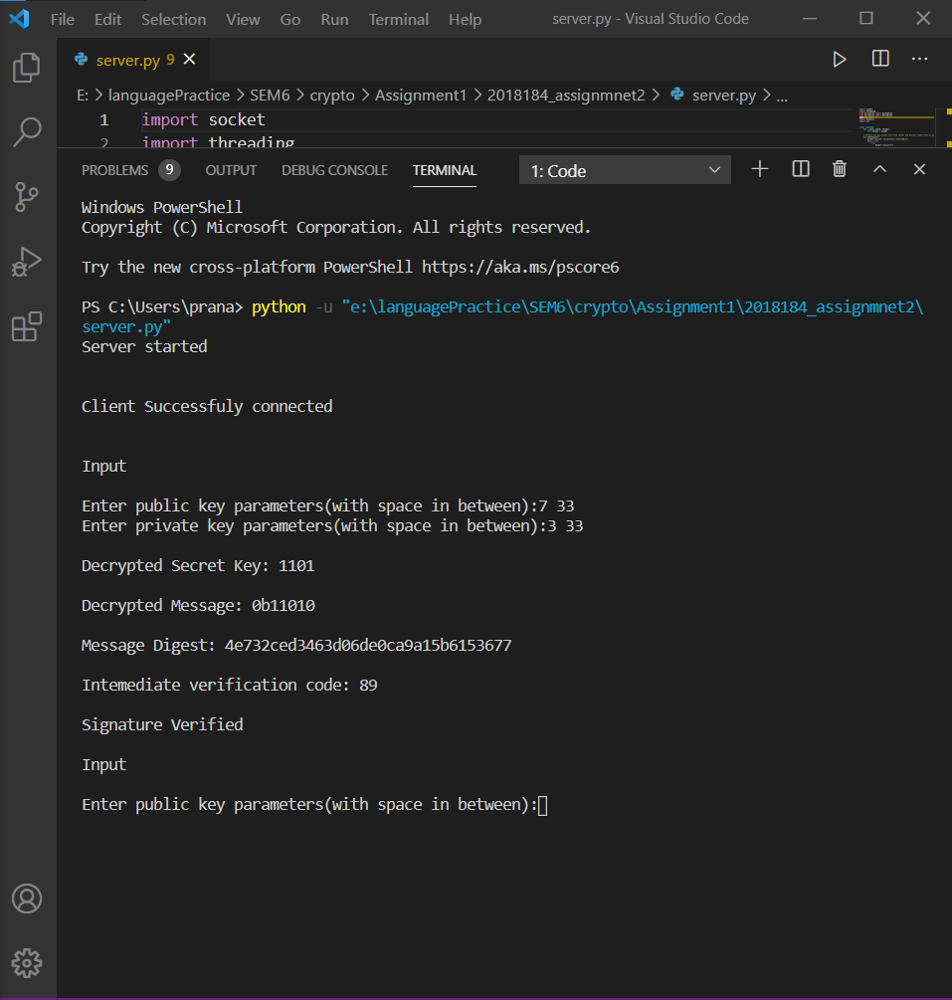

# Encryption_Decryption_Message

A client and server applications with confidential message exchange created to provide authentication, integrity and key sharing among both the client and server.
Implement the RSA algorithm that will be used for secret key encryption and digital signature.

- Client inputs: Message, Secret Key, Public and Private key parameters for Client
- Server Inputs: Public and Private key parameters for Server. 
- Message Flow:
  *   Client requests for public key of server.
  *   Server sends the public key.
  *   Client sends Ciphertext, Encrypted secret key, Client Signature, Client public key.
- Client side computation:
  *  Create Client signature through RSA algorithm, taking Digest from Hash algorithm and client private key as input.
  * Create Ciphertext through the AES variant, taking Message and Secret key as input.
  * Encrypt Secret key with RSA algorithm, taking Secret key and Server Public key as input.
- Server side Computation:
  * Decrypt Secret key using RSA algorithm 
  * Decrypt ciphertext using AES variant
  * Create message digest
  * Verify Client Signature
  
  
Working of the secure system will be as follows:
  

## Function of each file:
### constants.py:
   This file contains all constants which are used in process of encryption and decryption. For example, S-box;
### client.py:
This file contains code for client side. In this file user input is encrypted and sent to server using socket programming.
### server.py:
This file contains code for server side. In this file encrypted cipher side is received from client which is then decrypted and plain-text is generated.
### encryption.py
This file contains code for encryption of plain-text.
### decryption.py
This file contains code for decryption cipher-text.
### rsa.py
This file contains implementation of RSA algorithm.

## Result

Client            |  Server
:-------------------------:|:-------------------------:
  |  

